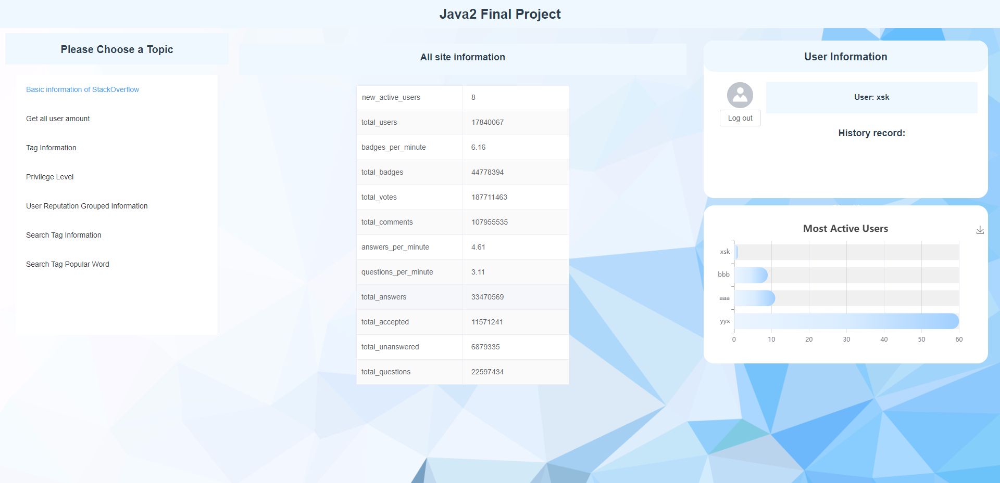
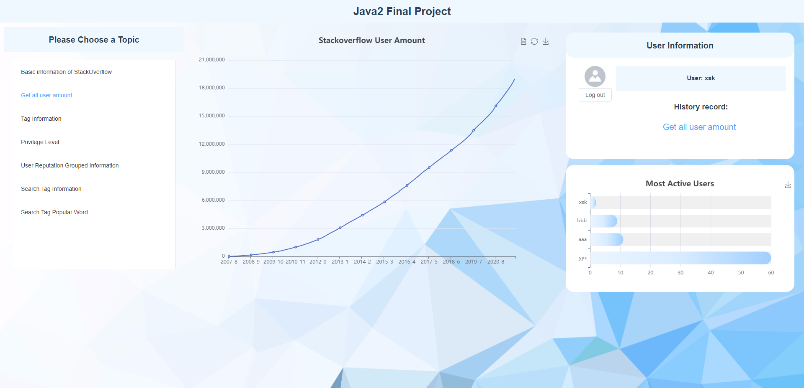
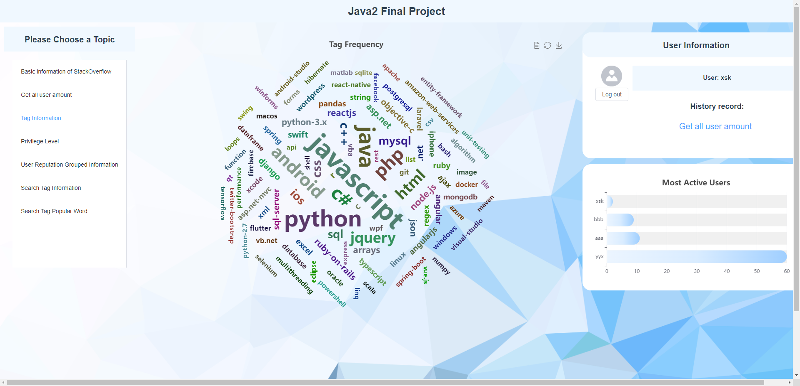
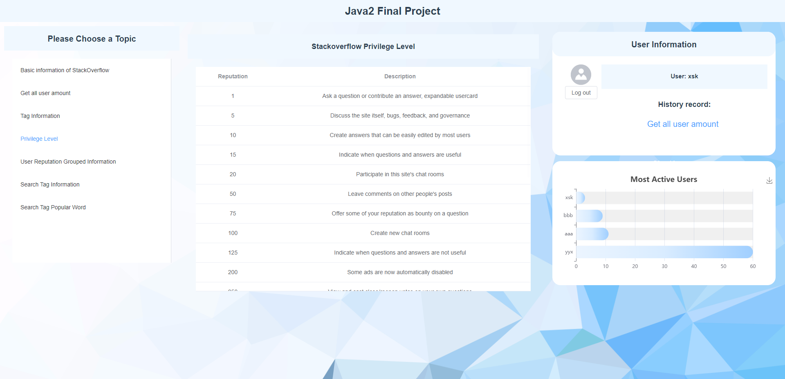
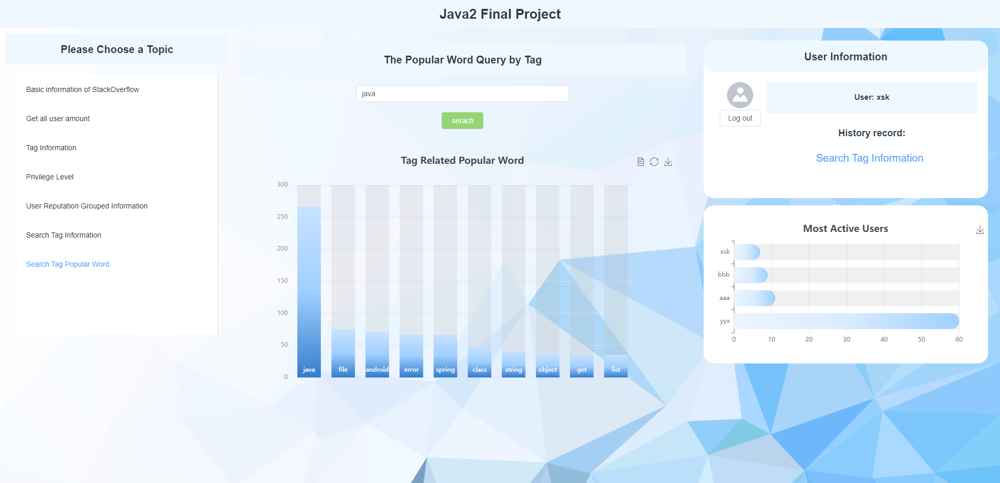

# 2022Spring-Java2-project

- **SUSTech 2022Spring Java2 project Created by Xie Shaokang, Yang Yixuan 2022-05**

- **Using Spring boot with Mybatics plus and Vue **


### How to build

- Make sure you have install spring boot and vue.

- For **springboottest** folder, it is a spring boot project. We first run it on *localhost://8081*.
- For **vuetest** folder, it is a vue project. Using ```npm run serve``` to run it on *localhost://8080*.


### Some example images











